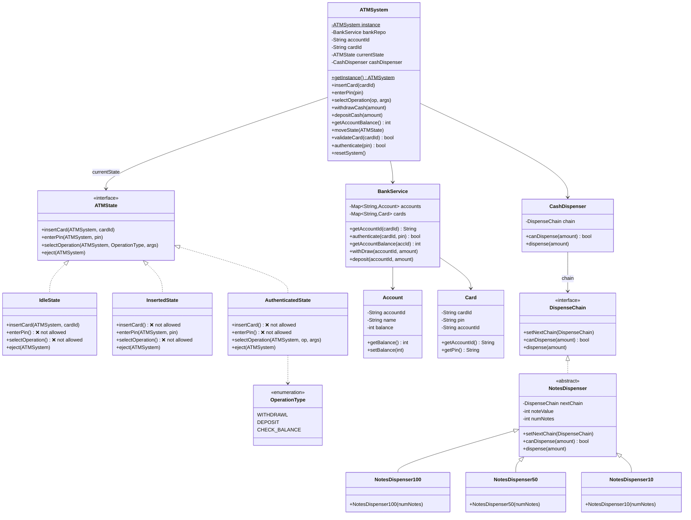
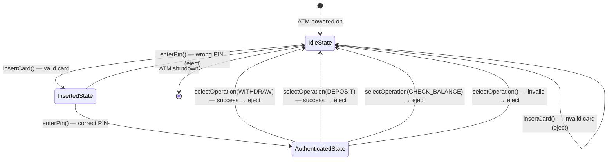
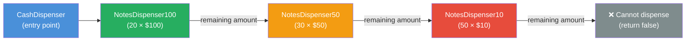
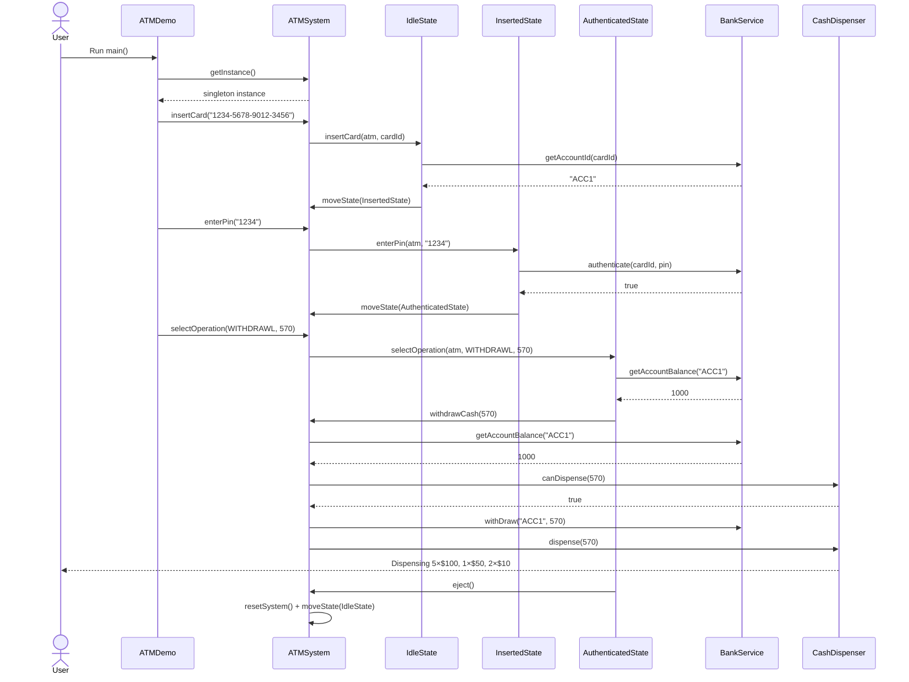
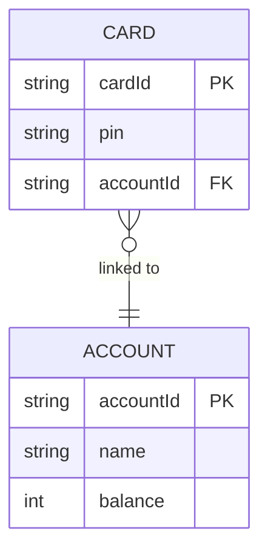

# 🏧 ATM System — Low-Level Design Summary

## 📌 Overview

A fully functional ATM simulation implementing two classic design patterns:
- **State Pattern** — models ATM lifecycle (Idle → Card Inserted → Authenticated)
- **Chain of Responsibility Pattern** — models note dispensing ($100 → $50 → $10)
- **Singleton Pattern** — ensures a single shared ATM instance

The system supports **Withdraw**, **Deposit**, and **Check Balance** operations with proper state transitions and cash dispensing logic.

---

## 📦 Package Structure

```
src/main/java/
├── client/          → ATMDemo.java           (Entry point)
├── constants/       → OperationType.java     (Enum: WITHDRAWAL, DEPOSIT, CHECK_BALANCE)
├── entity/          → Account.java, Card.java (Domain models)
├── repository/      → BankService.java, CashDispenser.java
├── dispenser/       → DispenseChain (interface), NotesDispenser (abstract), 
│                      NotesDispenser100, NotesDispenser50, NotesDispenser10
├── state/           → ATMState (interface), IdleState, InsertedState, AuthenticatedState
└── service/         → ATMSystem.java         (Core singleton orchestrator)
```

---

## 🗂️ Class Diagram



---

## 🔄 State Machine Diagram



---

## ⛓️ Chain of Responsibility — Cash Dispensing



**Example — Dispensing $570:**
| Denomination | Notes Used | Amount Covered |
|---|---|---|
| $100 | 5 | $500 |
| $50  | 1 | $50  |
| $10  | 2 | $20  |
| **Total** | **8 notes** | **$570** |

---

## 🔁 Sequence Diagram — Withdraw Flow



---

## 🎨 Design Patterns Used

| Pattern | Where Applied | Purpose |
|---|---|---|
| **Singleton** | `ATMSystem` | One shared ATM instance (thread-safe with `synchronized`) |
| **State** | `ATMState`, `IdleState`, `InsertedState`, `AuthenticatedState` | Enforces valid operation sequences; prevents invalid actions |
| **Chain of Responsibility** | `DispenseChain`, `NotesDispenser100/50/10` | Greedy note dispensing across denominations |

---

## 🧩 Key Design Decisions

### 1. Singleton — `ATMSystem`
```java
public synchronized static ATMSystem getInstance() {
    if (instance == null) {
        instance = new ATMSystem();
    }
    return instance;
}
```
- `synchronized` ensures thread safety for the first instantiation.
- The ATM holds a single `currentState` reference that gets swapped as the user progresses.

### 2. State Pattern
- Each state (`IdleState`, `InsertedState`, `AuthenticatedState`) only permits specific operations.
- Invalid operations simply print `"Operation not allowed"` — no exceptions thrown, no if-else chains in `ATMSystem`.
- `ATMSystem.moveState()` delegates state transitions cleanly.

### 3. Chain of Responsibility — Note Dispensing
```
c1 ($100) → c2 ($50) → c3 ($10)
```
- `canDispense()` traverses the chain *before* actually dispensing — acts as a pre-check guard.
- `dispense()` greedily uses the highest denomination first, passes remainder down.
- If dispensing throws after the bank debit, `ATMSystem` rolls back via `bankRepo.deposit()`.

### 4. Thread Safety on `CashDispenser`
```java
public synchronized boolean canDispense(int amount) { ... }
public synchronized void dispense(int amount) { ... }
```
- Prevents two concurrent sessions from dispensing the same physical notes.

---

## 🗃️ Entity Model



---

## 🚀 How to Run

```bash
# From project root
mvn compile
mvn exec:java -Dexec.mainClass="client.ATMDemo"
```

**Expected Output (partial):**
```
Card Validated Successfully
Pin validated Successfully
Account Balance: 1000
Transaction complete.
Ending session. Card has been ejected. Thank you for using our ATM.

Card Validated Successfully
Pin validated Successfully
Processing withdrawal for $570
Dispensing 5 x $100 note(s)
Dispensing 1 x $50 note(s)
Dispensing 2 x $10 note(s)
Transaction complete.
Ending session. Card has been ejected. Thank you for using our ATM.
```

---

## ⚠️ Error Scenarios Handled

| Scenario | Handling |
|---|---|
| Invalid card number | `IdleState` ejects immediately |
| Wrong PIN | `InsertedState` ejects, resets |
| Insufficient account balance | `AuthenticatedState` prints error, ejects |
| ATM out of cash | `CashDispenser.canDispense()` returns false |
| Dispensing exception after debit | `ATMSystem` rolls back via `deposit()` |
| Operation in wrong state | State returns `"Operation not allowed"` |

---

*Generated: March 15, 2026*

