# 📚 Library Management System — Design Document

---

## 📑 INDEX

| # | Section | Page |
|---|---------|------|
| **1** | [**What the System is About**](#1-what-the-system-is-about) | Overview, purpose, and scope |
| | ↳ [1.1 Purpose](#11-purpose) | Why this system exists |
| | ↳ [1.2 Core Entities](#12-core-entities) | The building blocks of the system |
| | ↳ [1.3 Project Structure](#13-project-structure) | Package and file layout |
| **2** | [**Client Options — What Can the User Do?**](#2-client-options--what-can-the-user-do) | All available operations |
| | ↳ [2.1 Operations Summary](#21-operations-summary) | Quick-reference table of all client actions |
| | ↳ [2.2 Add Library Items](#22-add-library-items) | Adding books, magazines to catalog |
| | ↳ [2.3 Register Members](#23-register-members) | Creating library members |
| | ↳ [2.4 Search the Catalog](#24-search-the-catalog) | Searching by title or author |
| | ↳ [2.5 Checkout a Copy](#25-checkout-a-copy) | Borrowing a physical copy |
| | ↳ [2.6 Return a Copy](#26-return-a-copy) | Returning a borrowed copy |
| | ↳ [2.7 Place a Hold](#27-place-a-hold) | Reserving a checked-out item |
| | ↳ [2.8 View Catalog](#28-view-catalog) | Printing current catalog state |
| **3** | [**Design Diagrams**](#3-design-diagrams) | UML and architectural visuals |
| | ↳ [3.1 Class Diagram](#31-class-diagram) | Full UML class diagram |
| | ↳ [3.2 State Transition Diagram](#32-state-transition-diagram) | BookCopy lifecycle states |
| | ↳ [3.3 High-Level Architecture](#33-high-level-architecture-diagram) | Component overview |
| **4** | [**Design Patterns Identified**](#4-design-patterns-identified) | All patterns used |
| | ↳ [4.1 Singleton Pattern](#41-singleton-pattern) | One instance of core services |
| | ↳ [4.2 Factory Method Pattern](#42-factory-method-pattern) | Decoupled item creation |
| | ↳ [4.3 State Pattern](#43-state-pattern) | BookCopy behavior by state |
| | ↳ [4.4 Strategy Pattern](#44-strategy-pattern) | Interchangeable search algorithms |
| | ↳ [4.5 Observer Pattern](#45-observer-pattern) | Hold notifications |
| | ↳ [4.6 Facade Pattern](#46-facade-pattern) | Simplified client API |
| **5** | [**System Flows**](#5-system-flows) | Detailed flow explanations |
| | ↳ [5.1 Flow 1 — Add Item to Catalog](#51-flow-1--add-item-to-catalog) | Item creation flow |
| | ↳ [5.2 Flow 2 — Search the Catalog](#52-flow-2--search-the-catalog) | Search flow |
| | ↳ [5.3 Flow 3 — Checkout a Copy](#53-flow-3--checkout-a-copy) | Checkout flow |
| | ↳ [5.4 Flow 4 — Return a Copy (No Holds)](#54-flow-4--return-a-copy-no-holds) | Simple return flow |
| | ↳ [5.5 Flow 5 — Place Hold → Return → Notify → Fulfill](#55-flow-5--place-hold--return--notify--fulfill) | The complete hold lifecycle |
| | ↳ [5.6 Flow 6 — Rejected Operations](#56-flow-6--rejected-operations) | Error/rejection scenarios |

---
---

# 1. What the System is About

## 1.1 Purpose

The **Library Management System** is a Java-based application that simulates the core operations of a real-world library. It allows a library to manage its catalog of items (books, magazines), register members, and track the borrowing and returning of physical copies.

The system is designed as a **Low-Level Design (LLD)** exercise that demonstrates how to build a clean, extensible object-oriented system using well-known design patterns. It focuses on:

- **Inventory Management** — Track multiple physical copies of each book/magazine.
- **Member Management** — Register members who can borrow and return items.
- **Loan Tracking** — Maintain a ledger of which member has borrowed which copy and when.
- **Hold / Reservation** — Allow members to place holds on checked-out items and get notified when they become available.
- **Flexible Search** — Search the catalog by different criteria (title, author) with the ability to add new criteria without changing existing code.

## 1.2 Core Entities

| Entity | Class | Description |
|--------|-------|-------------|
| **Library System** | `LibraryManagementSystem` | The central facade — single entry point for all operations |
| **Library Item** | `LibraryItem` (abstract) | Represents a title in the catalog (e.g., "The Hobbit") |
| **Book** | `Book` | A concrete library item with an author |
| **Magazine** | `Magazine` | A concrete library item with a publisher |
| **Book Copy** | `BookCopy` | A physical copy of a library item (e.g., copy #1 of "The Hobbit") |
| **Member** | `Member` | A registered library user who can borrow, return, and place holds |
| **Loan** | `Loan` | A record linking a borrowed copy to a member with a checkout date |
| **Transaction Service** | `TransactionService` | Manages the creation and removal of loan records |
| **Item Factory** | `ItemFactory` | Creates the correct item subclass based on item type |

## 1.3 Project Structure

```
librarymanagementsystem/
│
├── LibraryManagementSystem.java      ← Singleton Facade (main entry point)
├── TransactionService.java           ← Singleton (loan lifecycle manager)
├── LibraryManagementDemo.java        ← Demo / Driver class
│
├── enums/
│   └── ItemType.java                 ← Enum: BOOK, MAGAZINE
│
├── factory/
│   └── ItemFactory.java              ← Factory Method for creating items
│
├── models/
│   ├── LibraryItem.java              ← Abstract base class (also Observer Subject)
│   ├── Book.java                     ← Concrete: item with author
│   ├── Magazine.java                 ← Concrete: item with publisher
│   ├── BookCopy.java                 ← Physical copy (State Pattern context)
│   ├── Member.java                   ← Library user (also Observer)
│   └── Loan.java                     ← Borrow record (copy + member + date)
│
├── state/
│   ├── ItemState.java                ← State interface
│   ├── AvailableState.java           ← Copy is on the shelf
│   ├── CheckedOutState.java          ← Copy is borrowed by a member
│   └── OnHoldState.java              ← Copy is reserved for a hold-placer
│
└── strategy/
    ├── SearchStrategy.java           ← Strategy interface
    ├── SearchByTitleStrategy.java    ← Search catalog by title
    └── SearchByAuthorStrategy.java   ← Search catalog by author
```

---
---

# 2. Client Options — What Can the User Do?

The system is accessed through a single class: `LibraryManagementSystem.getInstance()`. This is the **Facade** — all operations go through it. The client never needs to interact with factories, states, or the transaction service directly.

## 2.1 Operations Summary

| # | Operation | Method Signature | Description |
|---|-----------|-----------------|-------------|
| 1 | Add Item | `addItem(ItemType type, String id, String title, String author, int numCopies)` | Add a book or magazine with N physical copies |
| 2 | Register Member | `addMember(String id, String name)` | Register a new library member |
| 3 | Search Catalog | `search(String query, SearchStrategy strategy)` | Search by title, author, or any custom strategy |
| 4 | Checkout | `checkout(String memberId, String copyId)` | Borrow a specific copy |
| 5 | Return | `returnItem(String copyId)` | Return a borrowed copy |
| 6 | Place Hold | `placeHold(String memberId, String itemId)` | Reserve a checked-out item |
| 7 | View Catalog | `printCatalog()` | Print all items and their availability |

## 2.2 Add Library Items

**What it does:** Creates a new library item (Book or Magazine) and generates the specified number of physical copies.

**How the client calls it:**
```
library.addItem(ItemType.BOOK, "B001", "The Hobbit", "J.R.R. Tolkien", 2);
library.addItem(ItemType.MAGAZINE, "M001", "National Geographic", "NatGeo Society", 3);
```

**What happens behind the scenes:**
- `ItemFactory` reads the `ItemType` enum and creates a `Book` or `Magazine` object.
- The item is stored in the catalog map.
- N `BookCopy` objects are created (e.g., "B001-c1", "B001-c2"), each starting in `AvailableState`.
- Each copy self-registers with its parent `LibraryItem`.

## 2.3 Register Members

**What it does:** Creates a new `Member` with a unique ID and name.

**How the client calls it:**
```
Member alice = library.addMember("MEM01", "Alice");
```

**What happens behind the scenes:**
- A `Member` object is created and stored in the members map.
- The member starts with an empty loan list.

## 2.4 Search the Catalog

**What it does:** Searches the catalog using a pluggable search algorithm chosen at runtime.

**How the client calls it:**
```
library.search("Dune", new SearchByTitleStrategy());
library.search("Tolkien", new SearchByAuthorStrategy());
```

**What happens behind the scenes:**
- The facade passes the full catalog and query to the chosen `SearchStrategy`.
- `SearchByTitleStrategy` filters items where `title.contains(query)` (case-insensitive).
- `SearchByAuthorStrategy` filters items where `authorOrPublisher.contains(query)` (case-insensitive).
- The client can add new strategies (e.g., SearchByISBN) without changing any existing code.

## 2.5 Checkout a Copy

**What it does:** A member borrows a specific physical copy.

**How the client calls it:**
```
library.checkout("MEM01", "B001-c1");
```

**What happens behind the scenes:**
- The facade resolves member and copy from their IDs.
- `BookCopy.checkout(member)` delegates to the current state.
- If the copy is `Available` → a `Loan` is created, state transitions to `CheckedOut`.
- If the copy is `CheckedOut` → rejected ("already checked out").
- If the copy is `OnHold` → only the hold-placer is allowed.

## 2.6 Return a Copy

**What it does:** Returns a previously borrowed copy to the library.

**How the client calls it:**
```
library.returnItem("B001-c1");
```

**What happens behind the scenes:**
- The facade resolves the copy from its ID.
- `BookCopy.returnItem()` delegates to the current state.
- `CheckedOutState` ends the loan and checks for holds.
- If no holds → state transitions to `Available`.
- If holds exist → state transitions to `OnHold`, all waiting members are notified.

## 2.7 Place a Hold

**What it does:** Reserves a checked-out item so the member is notified when it becomes available.

**How the client calls it:**
```
library.placeHold("MEM03", "B002");
```

**What happens behind the scenes:**
- The facade finds the `LibraryItem` and locates a checked-out copy.
- `CheckedOutState.placeHold()` adds the member as an observer on the `LibraryItem`.
- When the copy is eventually returned, the member's `update()` method is called automatically.

## 2.8 View Catalog

**What it does:** Prints the full catalog with availability counts.

**How the client calls it:**
```
library.printCatalog();
```

**Sample output:**
```
--- Library Catalog ---
ID: B001, Title: The Hobbit, Author/Publisher: J.R.R. Tolkien, Available: 2
ID: B002, Title: Dune, Author/Publisher: Frank Herbert, Available: 1
ID: M001, Title: National Geographic, Author/Publisher: NatGeo Society, Available: 3
-----------------------
```

---
---

# 3. Design Diagrams

## 3.1 Class Diagram

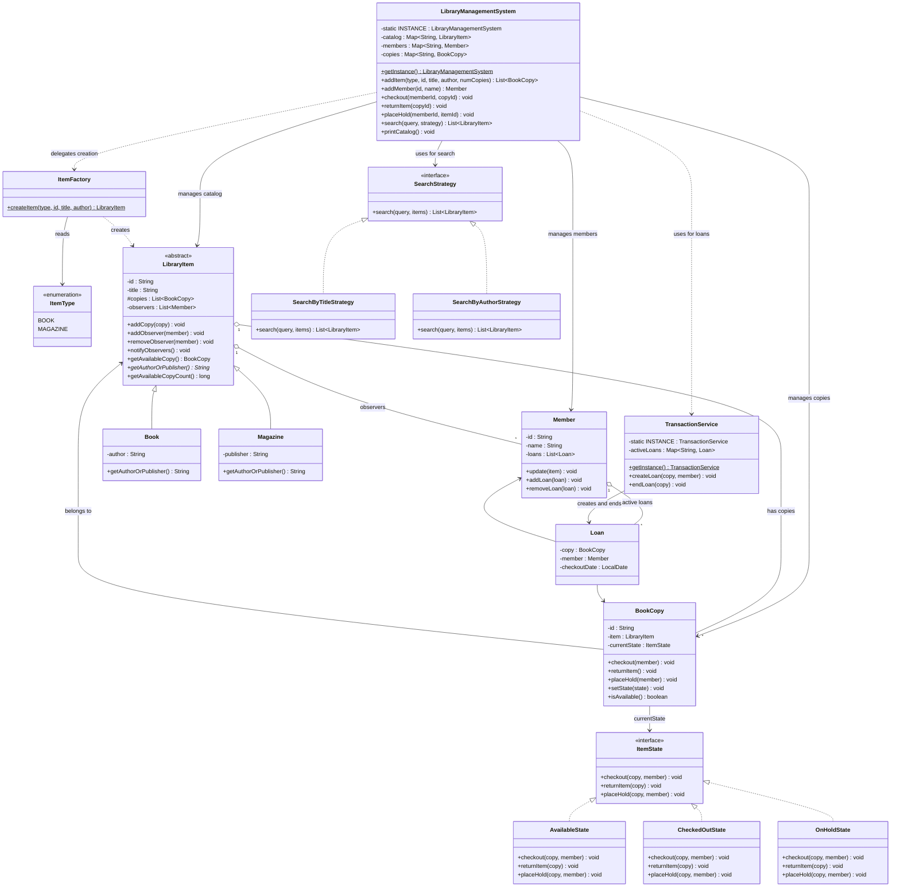

## 3.2 State Transition Diagram

Every `BookCopy` starts in `AvailableState` and transitions between three states based on user actions:

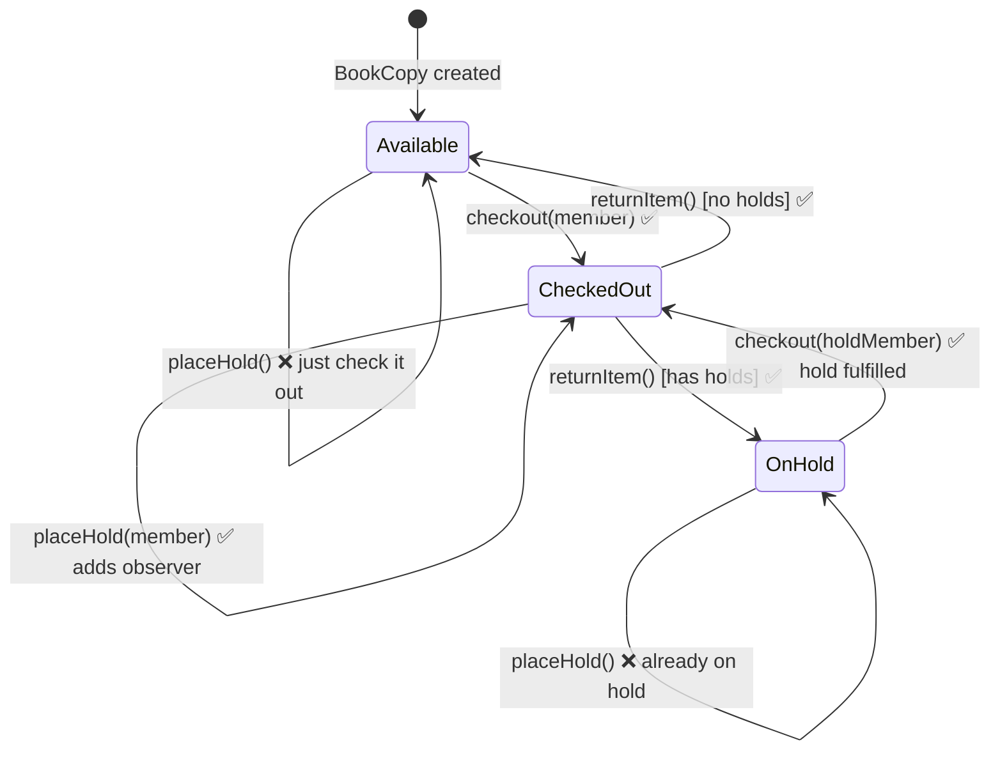

**State × Action Matrix:**

| Current State | `checkout(member)` | `returnItem()` | `placeHold(member)` |
|---|---|---|---|
| **Available** | ✅ Create loan → `CheckedOut` | ❌ Already available | ❌ Just check it out |
| **CheckedOut** | ❌ Already checked out | ✅ End loan → `Available` or `OnHold` | ✅ Add member to observer list |
| **OnHold** | ✅ Only if hold-placer → `CheckedOut` | ❌ Not checked out | ❌ Already on hold |

## 3.3 High-Level Architecture Diagram

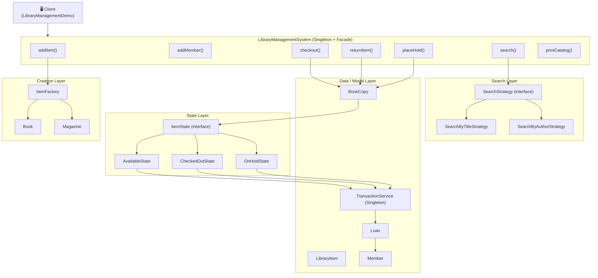

---
---

# 4. Design Patterns Identified

This system uses **6 design patterns**:

| # | Pattern | Category | Where Used | Why Used |
|---|---------|----------|-----------|----------|
| 1 | **Singleton** | Creational | `LibraryManagementSystem`, `TransactionService` | One library, one loan ledger |
| 2 | **Factory Method** | Creational | `ItemFactory` | Decouple item creation from client |
| 3 | **State** | Behavioral | `ItemState`, `AvailableState`, `CheckedOutState`, `OnHoldState` | BookCopy behavior changes with state |
| 4 | **Strategy** | Behavioral | `SearchStrategy`, `SearchByTitleStrategy`, `SearchByAuthorStrategy` | Swappable search algorithms |
| 5 | **Observer** | Behavioral | `LibraryItem` (Subject), `Member` (Observer) | Notify members when held item returns |
| 6 | **Facade** | Structural | `LibraryManagementSystem` | Single API hides internal complexity |

---

## 4.1 Singleton Pattern

**What is it?**
The Singleton pattern ensures a class has **exactly one instance** and provides a global access point to it. It prevents multiple instances from creating inconsistent state.

**Where is it used?**
- `LibraryManagementSystem` — There is one library with one catalog, one member registry, and one copy registry. Two instances would mean two separate catalogs out of sync.
- `TransactionService` — There is one loan ledger. If two instances existed, a loan created in one would be invisible to the other, causing data corruption.

**How is it implemented?**
Both classes use **eager initialization** — the instance is created when the class is loaded, before any thread can access it:

```
private static final LibraryManagementSystem INSTANCE = new LibraryManagementSystem();
private LibraryManagementSystem() {}               // private constructor blocks external creation
public static LibraryManagementSystem getInstance() { return INSTANCE; }
```

The private constructor prevents anyone from calling `new LibraryManagementSystem()`. The only way to get the instance is through `getInstance()`.

**Diagram:**

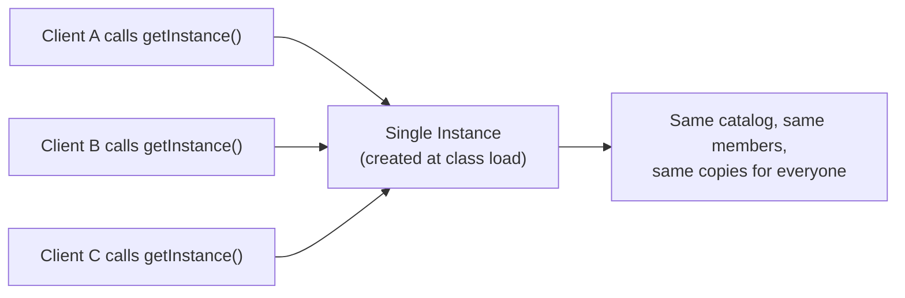

---

## 4.2 Factory Method Pattern

**What is it?**
The Factory pattern provides a method for creating objects without exposing the instantiation logic to the client. The client asks for an object by type, and the factory decides which concrete class to create.

**Where is it used?**
`ItemFactory.createItem(ItemType, id, title, author)` — Takes an enum and returns the correct subclass of `LibraryItem`.

**Why is it needed?**
Without a factory, `LibraryManagementSystem.addItem()` would need to know about every concrete class (`Book`, `Magazine`, and any future type). Adding a new item type would require modifying the facade — violating the **Open/Closed Principle**. With the factory, the facade just calls `ItemFactory.createItem()` and works with the `LibraryItem` abstraction.

**How to extend:**
To add a new item type (e.g., `DVD`):
1. Add `DVD` to the `ItemType` enum.
2. Create `Dvd extends LibraryItem`.
3. Add one case in `ItemFactory.createItem()`.
4. Zero changes to `LibraryManagementSystem` or any other class.

**Diagram:**

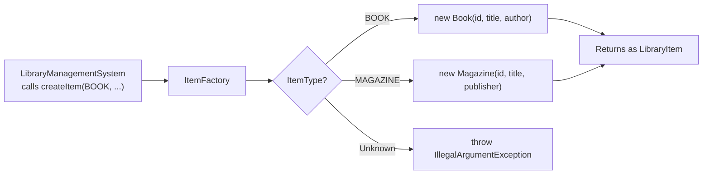

---

## 4.3 State Pattern

**What is it?**
The State pattern allows an object to change its behavior when its internal state changes. Instead of writing `if/else` blocks checking a status field, each state is a separate class that implements the behavior for that state. The object delegates all actions to its current state.

**Where is it used?**
`BookCopy` is the **context** — it holds a reference to `currentState` (an `ItemState` interface). Every action (`checkout`, `returnItem`, `placeHold`) is a one-line delegation:

```
public void checkout(Member member) { currentState.checkout(this, member); }
```

The three concrete states are:

| State Class | Meaning | What it allows |
|---|---|---|
| `AvailableState` | Copy is on the shelf | Checkout ✅ |
| `CheckedOutState` | Copy is with a member | Return ✅, Place Hold ✅ |
| `OnHoldState` | Copy is reserved for a hold-placer | Checkout by hold-placer only ✅ |

**Why is it needed?**
Without the State pattern, `BookCopy` would have code like:
```
void checkout(Member m) {
    if (status == AVAILABLE) { ... }
    else if (status == CHECKED_OUT) { ... }
    else if (status == ON_HOLD) { ... }
}
```
This creates 3 states × 3 methods = 9 conditional branches, all mixed together. Adding a new state (e.g., `LOST`) adds 3 more branches to every method. The State pattern eliminates all conditionals — each state class handles only its own behavior and transitions.

**Diagram — State class hierarchy:**

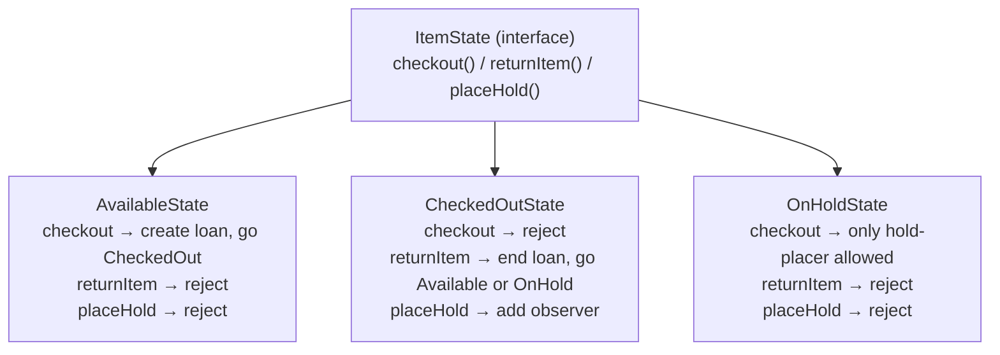

---

## 4.4 Strategy Pattern

**What is it?**
The Strategy pattern defines a family of algorithms, encapsulates each one in its own class, and makes them interchangeable at runtime. The client selects which algorithm to use when calling the method.

**Where is it used?**
Catalog search. `SearchStrategy` is the interface. Each concrete strategy implements a different search algorithm:

- `SearchByTitleStrategy` — Filters items where the title contains the query (case-insensitive).
- `SearchByAuthorStrategy` — Filters items where the author/publisher contains the query (case-insensitive).

**Why is it needed?**
The facade's `search()` method does not contain any search logic at all:
```
public List<LibraryItem> search(String query, SearchStrategy strategy) {
    return strategy.search(query, new ArrayList<>(catalog.values()));
}
```
The algorithm is injected by the caller. This means:
- Adding a new search (e.g., `SearchByISBNStrategy`) requires creating one new class.
- Zero changes to `LibraryManagementSystem` or any existing strategy.
- The client picks the algorithm at runtime — not at compile time.

**Diagram:**

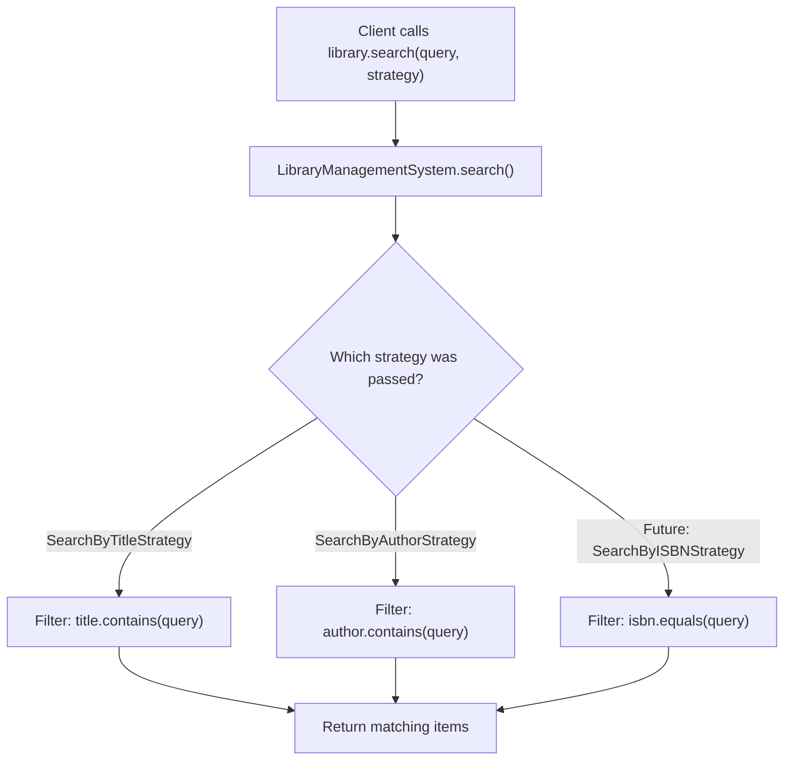

---

## 4.5 Observer Pattern

**What is it?**
The Observer pattern defines a one-to-many relationship between objects. When a **Subject** changes state, all registered **Observers** are notified automatically. This is also known as Publish-Subscribe.

**Where is it used?**

| Role | Class | Responsibility |
|------|-------|----------------|
| **Subject** | `LibraryItem` | Maintains a list of `Member` observers. Provides `addObserver()`, `removeObserver()`, `notifyObservers()`. |
| **Observer** | `Member` | Has an `update(LibraryItem)` method that receives the notification. |
| **Trigger** | `CheckedOutState.returnItem()` | Detects the state change and triggers `notifyObservers()`. |

**Why is it needed?**
Without the Observer pattern, a member who wants a checked-out book would have to repeatedly check availability (polling). The Observer pattern inverts this — the member subscribes once, and the system **pushes** the notification automatically when the item becomes available.

**The lifecycle:**
1. **Subscribe:** Member calls `placeHold()` → `CheckedOutState` adds the member as an observer on the `LibraryItem`.
2. **Trigger:** Another member returns the copy → `CheckedOutState.returnItem()` checks `hasObservers()` → true.
3. **Notify:** `LibraryItem.notifyObservers()` calls `member.update(item)` for each observer.
4. **Fulfill:** The notified member calls `checkout()` → `OnHoldState` verifies they are the observer → hold fulfilled.

**Important detail:** Observers are placed on `LibraryItem` (the *title*), not on `BookCopy` (the physical copy). This means returning *any* copy of "Dune" can satisfy a hold on "Dune". The hold is on the concept, not the physical object.

**Diagram:**

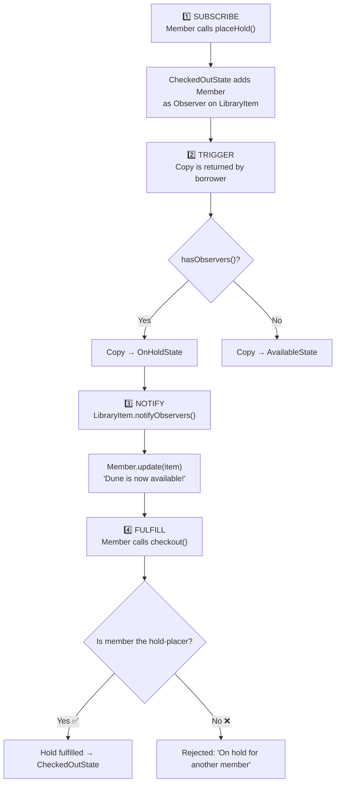

---

## 4.6 Facade Pattern

**What is it?**
The Facade pattern provides a single, simplified interface to a complex subsystem. The client interacts only with the facade, which internally coordinates multiple classes to fulfill each request.

**Where is it used?**
`LibraryManagementSystem` is the facade. Behind its simple API, it coordinates:

| Hidden Subsystem | What it does |
|---|---|
| `ItemFactory` | Creates the correct `LibraryItem` subclass |
| `BookCopy` + `ItemState` | Manages state transitions and behavioral rules |
| `TransactionService` | Creates and ends `Loan` records |
| `LibraryItem` observers | Manages hold notifications |
| Internal `HashMap` lookups | Resolves String IDs to domain objects |

**Why is it needed?**
Without the facade, the client (demo class) would need to:
1. Call `ItemFactory.createItem()` directly
2. Manually create `BookCopy` objects and register them
3. Call `TransactionService.getInstance().createLoan()` directly
4. Manage observer subscriptions manually
5. Maintain its own maps for lookups

The facade reduces all of this to simple method calls like `library.checkout("MEM01", "B001-c1")`.

**Diagram:**

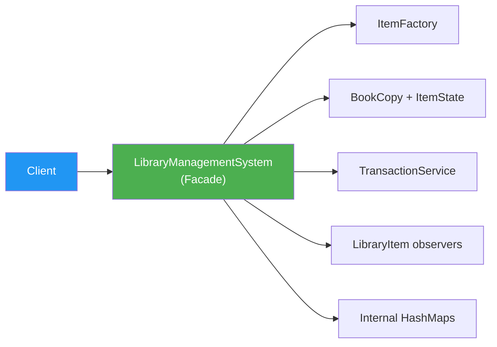

---
---

# 5. System Flows

This section traces every major operation step-by-step, explaining **what happens inside the system** at each stage.

---

## 5.1 Flow 1 — Add Item to Catalog

**Trigger:** Client calls `library.addItem(ItemType.BOOK, "B001", "The Hobbit", "Tolkien", 2)`

**Patterns involved:** Facade, Factory Method

**Step-by-step:**

| Step | What happens | Who does it |
|------|-------------|-------------|
| 1 | Client calls `addItem()` on the facade | `LibraryManagementSystem` |
| 2 | Facade delegates to `ItemFactory.createItem(BOOK, ...)` | `ItemFactory` |
| 3 | Factory reads the `ItemType` enum, matches `BOOK`, creates `new Book("B001", "The Hobbit", "Tolkien")` | `ItemFactory` |
| 4 | `Book` constructor calls `super("B001", "The Hobbit")` which initializes an empty copies list and empty observers list | `LibraryItem` |
| 5 | Facade stores the item in `catalog.put("B001", item)` | `LibraryManagementSystem` |
| 6 | Facade enters a loop to create 2 copies: `BookCopy("B001-c1", item)` and `BookCopy("B001-c2", item)` | `LibraryManagementSystem` |
| 7 | Each `BookCopy` constructor sets `currentState = new AvailableState()` and calls `item.addCopy(this)` — **self-registration** | `BookCopy` |
| 8 | Facade stores each copy in `copies.put("B001-c1", copy)` | `LibraryManagementSystem` |
| 9 | Returns the list of created copies to the client | `LibraryManagementSystem` |

**Sequence Diagram:**

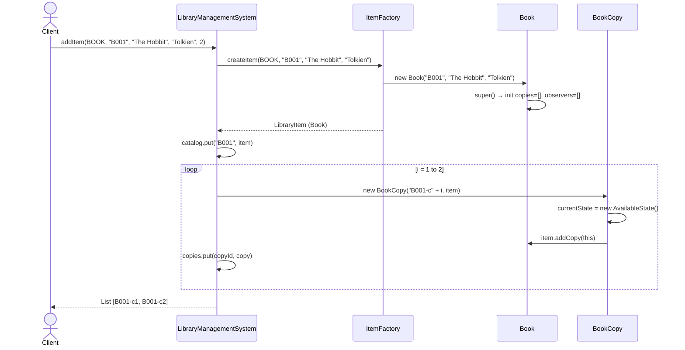

---

## 5.2 Flow 2 — Search the Catalog

**Trigger:** Client calls `library.search("Dune", new SearchByTitleStrategy())`

**Patterns involved:** Facade, Strategy

**Step-by-step:**

| Step | What happens | Who does it |
|------|-------------|-------------|
| 1 | Client creates a `SearchByTitleStrategy` and passes it along with the query to `search()` | Client |
| 2 | Facade converts the catalog map values into a `List<LibraryItem>` | `LibraryManagementSystem` |
| 3 | Facade calls `strategy.search("Dune", catalogList)` — it does not know or care *how* the search works | `LibraryManagementSystem` |
| 4 | `SearchByTitleStrategy` streams over all items, filters where `title.toLowerCase().contains("dune")` | `SearchByTitleStrategy` |
| 5 | Matching items are collected into a result list and returned | `SearchByTitleStrategy` |
| 6 | Facade returns the result to the client | `LibraryManagementSystem` |

**Key insight:** The `search()` method in the facade is a single line of delegation. The entire search logic lives in the strategy class. Swapping the strategy object changes the algorithm without touching the facade.

**Sequence Diagram:**

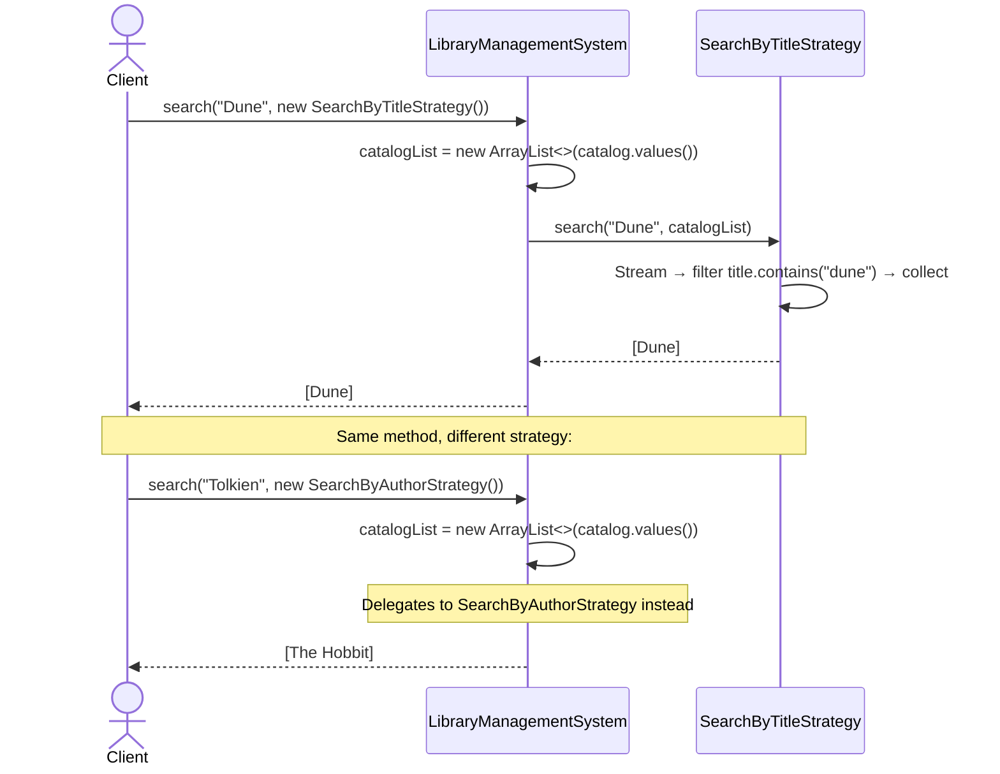

---

## 5.3 Flow 3 — Checkout a Copy

**Trigger:** Client calls `library.checkout("MEM01", "B001-c1")`

**Patterns involved:** Facade, State, Singleton

**Step-by-step:**

| Step | What happens | Who does it |
|------|-------------|-------------|
| 1 | Facade resolves `"MEM01"` → `Member(Alice)` and `"B001-c1"` → `BookCopy` from internal maps | `LibraryManagementSystem` |
| 2 | If either is null → prints error and returns | `LibraryManagementSystem` |
| 3 | Calls `bookCopy.checkout(alice)` | `BookCopy` |
| 4 | `BookCopy` delegates to `currentState.checkout(this, alice)` | `BookCopy` |
| 5 | **AvailableState** handles it: calls `TransactionService.getInstance().createLoan(copy, alice)` | `AvailableState` |
| 6 | `TransactionService` validates no active loan exists for this copy, creates `new Loan(copy, alice)` with today's date | `TransactionService` |
| 7 | Loan is stored in `activeLoans` map and added to `alice.loans` | `TransactionService` |
| 8 | `AvailableState` transitions the copy: `copy.setState(new CheckedOutState())` | `AvailableState` |
| 9 | Prints "B001-c1 checked out by Alice" | `AvailableState` |

**After this flow:** The copy's state is now `CheckedOutState`. Any further `checkout()` calls on this copy will be handled by `CheckedOutState`, which rejects them.

**Sequence Diagram:**

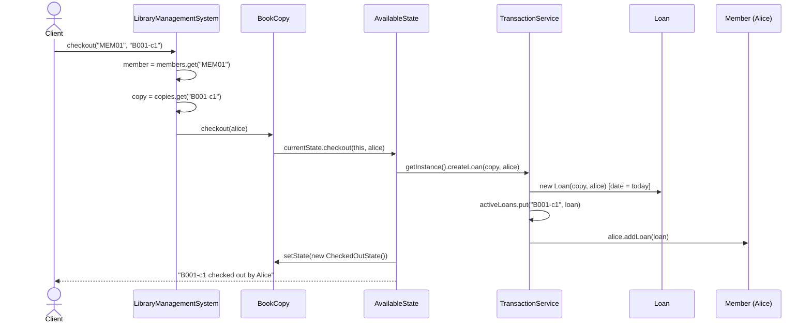

---

## 5.4 Flow 4 — Return a Copy (No Holds)

**Trigger:** Client calls `library.returnItem("B001-c1")` and nobody has placed a hold on this item.

**Patterns involved:** Facade, State, Singleton

**Step-by-step:**

| Step | What happens | Who does it |
|------|-------------|-------------|
| 1 | Facade resolves `"B001-c1"` → `BookCopy` from internal map | `LibraryManagementSystem` |
| 2 | Calls `bookCopy.returnItem()` | `BookCopy` |
| 3 | `BookCopy` delegates to `currentState.returnItem(this)` | `BookCopy` |
| 4 | **CheckedOutState** handles it: calls `TransactionService.getInstance().endLoan(copy)` | `CheckedOutState` |
| 5 | `TransactionService` removes the loan from `activeLoans` map and calls `member.removeLoan(loan)` | `TransactionService` |
| 6 | `CheckedOutState` checks `copy.getItem().hasObservers()` → **false** (no holds) | `CheckedOutState` |
| 7 | Transitions the copy: `copy.setState(new AvailableState())` | `CheckedOutState` |
| 8 | Prints "B001-c1 returned." | `CheckedOutState` |

**After this flow:** The copy is back in `AvailableState`. Anyone can check it out.

**Sequence Diagram:**

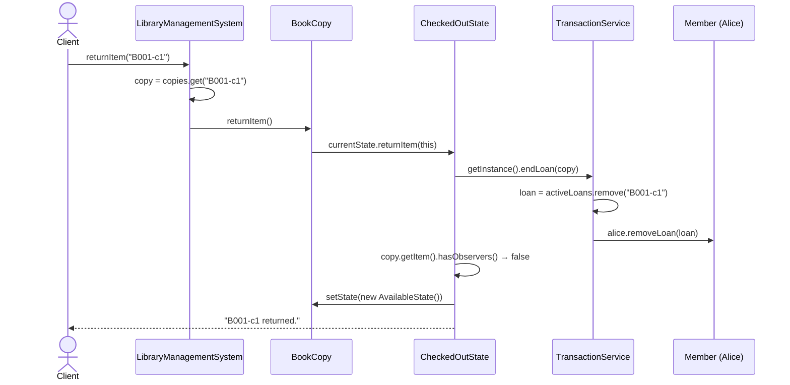

---

## 5.5 Flow 5 — Place Hold → Return → Notify → Fulfill

This is the **most complex flow** in the system. It spans four phases and involves the State, Observer, and Singleton patterns working together.

**Scenario:** Bob has checked out "Dune". Charlie wants "Dune" but it's unavailable.

---

### Phase A: Charlie Places a Hold

**Trigger:** `library.placeHold("MEM03", "B002")`

| Step | What happens | Who does it |
|------|-------------|-------------|
| 1 | Facade resolves `"MEM03"` → Charlie and `"B002"` → LibraryItem (Dune) | `LibraryManagementSystem` |
| 2 | Facade streams over Dune's copies, finds the first non-available copy (Dune-c1 in `CheckedOutState`) | `LibraryManagementSystem` |
| 3 | Calls `duneCopy.placeHold(charlie)` | `BookCopy` |
| 4 | `BookCopy` delegates to `currentState.placeHold(this, charlie)` | `BookCopy` |
| 5 | **CheckedOutState** handles it: calls `copy.getItem().addObserver(charlie)` — Charlie is now subscribed to the "Dune" `LibraryItem` | `CheckedOutState` |
| 6 | Prints "Charlie placed a hold on 'Dune'" | `CheckedOutState` |

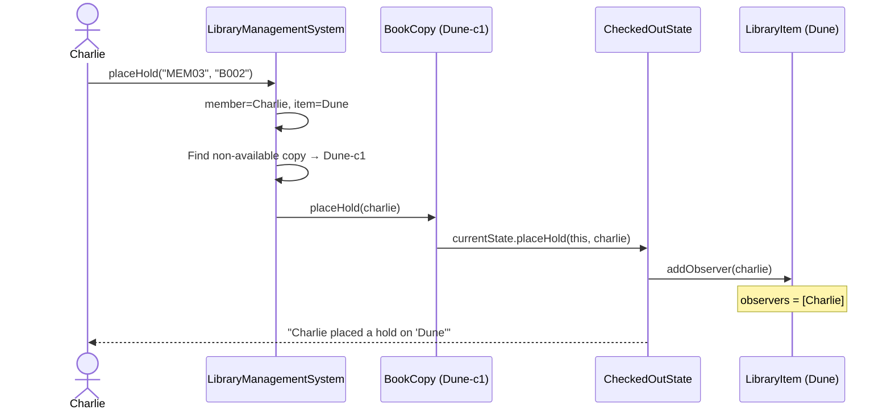

---

### Phase B: Bob Returns "Dune" → Charlie Gets Notified

**Trigger:** `library.returnItem("B002-c1")`

| Step | What happens | Who does it |
|------|-------------|-------------|
| 1 | Facade resolves `"B002-c1"` → BookCopy (Dune-c1) | `LibraryManagementSystem` |
| 2 | `BookCopy` delegates to `CheckedOutState.returnItem(this)` | `BookCopy` |
| 3 | `CheckedOutState` calls `TransactionService.endLoan(copy)` → removes Bob's loan | `TransactionService` |
| 4 | `CheckedOutState` checks `copy.getItem().hasObservers()` → **true** (Charlie is waiting) | `CheckedOutState` |
| 5 | ⚡ Different from Flow 4: instead of going to `AvailableState`, transitions to **`OnHoldState`** | `CheckedOutState` |
| 6 | Calls `copy.getItem().notifyObservers()` | `CheckedOutState` |
| 7 | `LibraryItem` creates a defensive copy of the observer list and iterates: calls `charlie.update(dune)` | `LibraryItem` |
| 8 | Charlie's `update()` prints: "NOTIFICATION for Charlie: The book 'Dune' you placed a hold on is now available!" | `Member` |

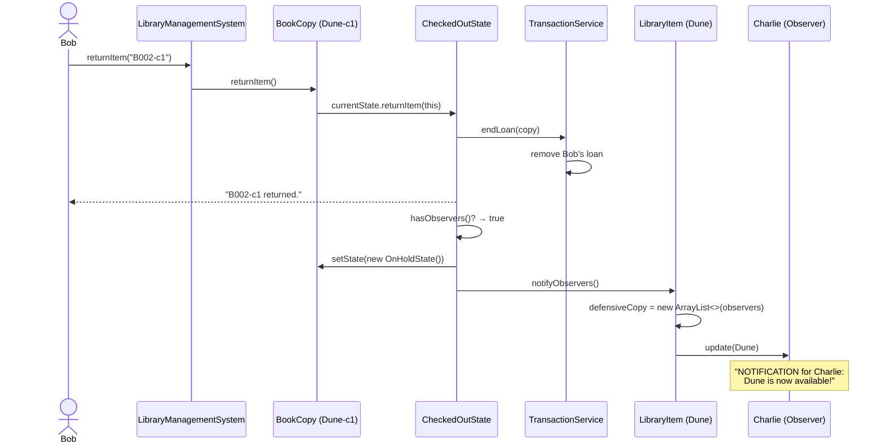

---

### Phase C: Charlie Fulfills the Hold

**Trigger:** `library.checkout("MEM03", "B002-c1")`

| Step | What happens | Who does it |
|------|-------------|-------------|
| 1 | Facade resolves Charlie and Dune-c1 | `LibraryManagementSystem` |
| 2 | `BookCopy` delegates to `OnHoldState.checkout(this, charlie)` | `BookCopy` |
| 3 | `OnHoldState` checks `copy.getItem().isObserver(charlie)` → **true** ✅ | `OnHoldState` |
| 4 | Creates a new loan via `TransactionService.createLoan(copy, charlie)` | `TransactionService` |
| 5 | Removes Charlie from observer list: `copy.getItem().removeObserver(charlie)` | `OnHoldState` |
| 6 | Transitions to `CheckedOutState` | `OnHoldState` |
| 7 | Prints "Hold fulfilled. B002-c1 checked out by Charlie" | `OnHoldState` |

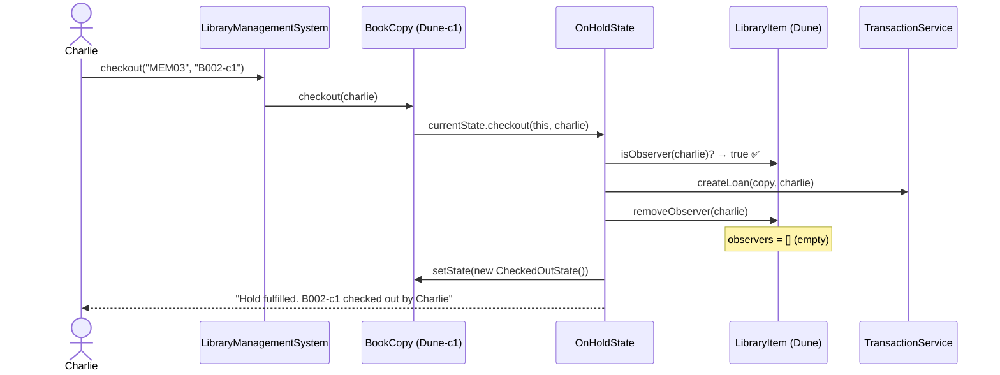

---

### Phase D: Alice Tries to Checkout (Rejected)

**Trigger:** `library.checkout("MEM01", "B002-c1")`

| Step | What happens | Who does it |
|------|-------------|-------------|
| 1 | Facade resolves Alice and Dune-c1 | `LibraryManagementSystem` |
| 2 | `BookCopy` delegates to `CheckedOutState.checkout(this, alice)` | `BookCopy` |
| 3 | `CheckedOutState` rejects: "B002-c1 is already checked out." | `CheckedOutState` |
| 4 | No state change occurs | — |

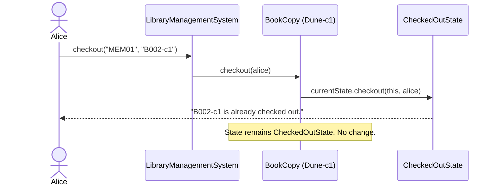

---

## 5.6 Flow 6 — Rejected Operations

The State pattern ensures that invalid actions are gracefully rejected. Here is every rejection scenario:

| Current State | Action Attempted | Rejection Message | Why? |
|---|---|---|---|
| `AvailableState` | `returnItem()` | "Cannot return an item that is already available." | There is no loan to end — the item was never checked out. |
| `AvailableState` | `placeHold()` | "Cannot place hold on an available item. Please check it out." | No need to wait — the item is right there on the shelf. |
| `CheckedOutState` | `checkout()` | "[copyId] is already checked out." | The copy is with another member. You can place a hold instead. |
| `OnHoldState` | `checkout()` by non-hold member | "This item is on hold for another member." | Only the member who placed the hold can check it out. |
| `OnHoldState` | `returnItem()` | "Invalid action. Item is on hold, not checked out." | The copy is not currently loaned — it's sitting in reservation. |
| `OnHoldState` | `placeHold()` | "Item is already on hold." | There is already a hold in progress. |

**Why rejections live in the State classes and not in the Facade:**
If the facade handled rejections (e.g., `if (copy.isAvailable()) ...`), then every time a new state is added (e.g., `LostState`, `UnderRepairState`), the facade would need new `if/else` branches. By putting rejection logic in the state classes, the facade remains unchanged when states are added — this is the **Open/Closed Principle**.

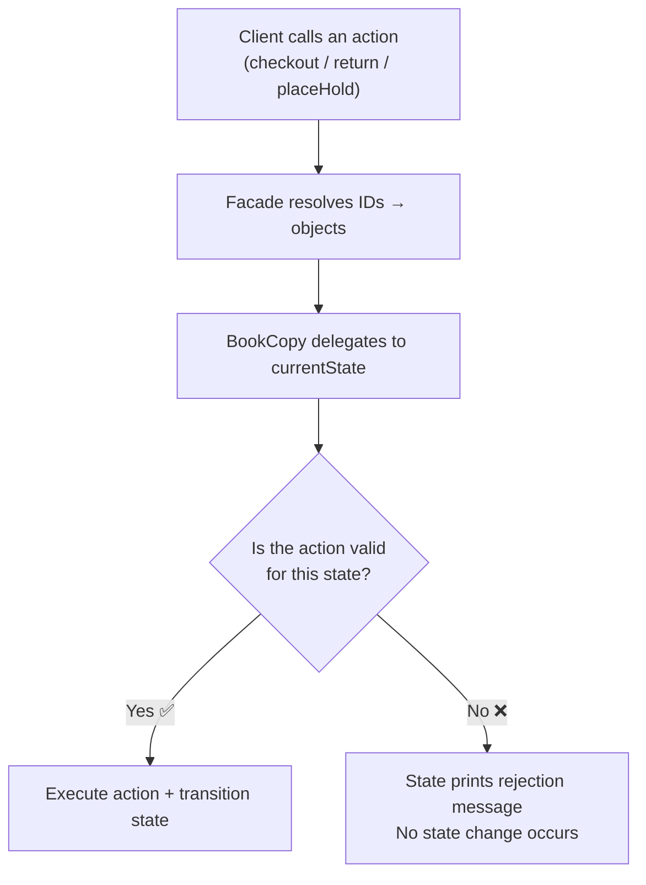

---
---

*Document generated for the Library Management System LLD project.*

